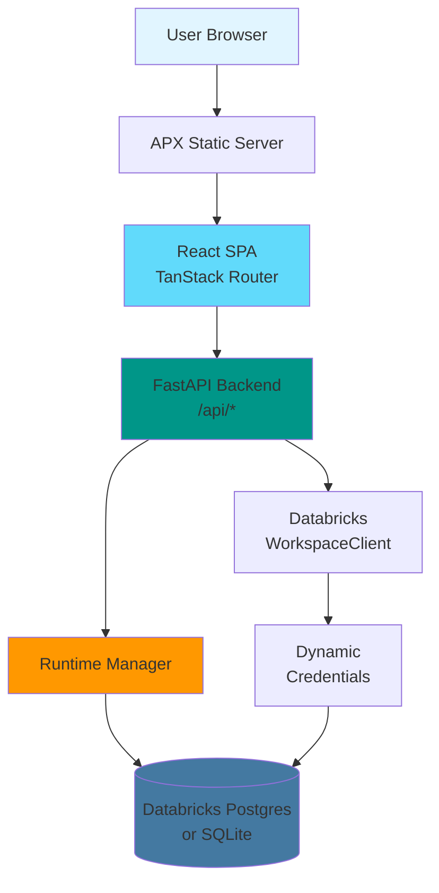

# lpt-event

> A modern, full-stack event management application built with [`apx`](https://github.com/databricks-solutions/apx) for deployment on Databricks

[](https://github.com/databricks-solutions/apx)
[](https://www.python.org/downloads/)
[](https://fastapi.tiangolo.com/)
[](https://react.dev/)

## 📋 Table of Contents

- [Overview](#overview)
- [Features](#features)
- [Architecture](#architecture)
- [Tech Stack](#-tech-stack)
- [Prerequisites](#prerequisites)
- [Installation](#installation)
- [Configuration](#configuration)
- [Development](#-development)
- [Data Schema](#data-schema)
- [API Endpoints](#api-endpoints)
- [Building](#-building)
- [Deployment](#-deployment)
- [Troubleshooting](#troubleshooting)
- [Contributing](#contributing)

## Overview

**lpt-event** is a full-stack event management application designed to run on Databricks as a modern web application. It enables users to create, manage, and browse events with a clean, responsive interface.

### Business Purpose

This application provides a centralized platform for:
- **Event Discovery**: Browse and search events by city, date, and cost
- **Event Management**: Create, update, and delete events with rich details
- **User Authentication**: Secure access using Databricks OAuth with on-behalf-of (OBO) token support
- **Data Persistence**: Store event data in Databricks Postgres with automatic schema management

### Key Use Cases

1. **Community Event Management**: Track meetups, conferences, and workshops
2. **Internal Company Events**: Manage team events, trainings, and social gatherings
3. **Public Event Discovery**: Allow users to browse and discover events in their area

## Features

✅ **Full-Stack Application**
- Modern React frontend with shadcn/ui components
- FastAPI backend with automatic OpenAPI documentation
- Type-safe API client auto-generated from OpenAPI schema

✅ **Flexible Database Support**
- Production: Databricks Postgres with dynamic credential generation
- Development: In-memory SQLite for rapid local iteration
- Automatic table creation and seeding

✅ **Authentication & Security**
- Databricks OAuth integration
- On-behalf-of (OBO) token support for user-scoped requests
- Service principal authentication for database access
- Secure credential management

✅ **Developer Experience**
- Hot reload for frontend and backend
- Type checking for Python and TypeScript
- Auto-generated API client from OpenAPI
- Comprehensive logging with colored output
- Single command to start all services

✅ **Production Ready**
- Built-in static file serving
- SPA client-side routing support
- Database connection pooling
- Error handling and validation
- Databricks Apps deployment

## Architecture



### Component Overview

**Frontend** (`src/lpt_event/ui/`)
- React 18 with TanStack Router for type-safe routing
- shadcn/ui components with Tailwind CSS
- React Query for server state management
- Auto-generated API client using orval

**Backend** (`src/lpt_event/backend/`)
- FastAPI application with automatic OpenAPI docs
- SQLModel for database models and migrations
- Pydantic for request/response validation
- Custom logging with colored, structured output
- OBO token support for user authentication

**Database**
- Production: Databricks Postgres with service principal auth
- Development: SQLite in-memory for rapid iteration
- Automatic schema creation via SQLModel
- Demo data seeding on first run

## 🛠️ Tech Stack

### Backend
- **Framework**: [FastAPI](https://fastapi.tiangolo.com/) - Modern, fast Python web framework
- **ORM**: [SQLModel](https://sqlmodel.tiangolo.com/) - SQL databases using Python type hints
- **Validation**: [Pydantic](https://docs.pydantic.dev/) - Data validation using Python annotations
- **Database**: Databricks Postgres (production), SQLite (development)
- **SDK**: [Databricks SDK](https://docs.databricks.com/dev-tools/sdk-python.html) - Python SDK for Databricks APIs
- **Server**: [Uvicorn](https://www.uvicorn.org/) - ASGI server implementation

### Frontend
- **Framework**: [React 18](https://react.dev/) - Component-based UI library
- **Router**: [TanStack Router](https://tanstack.com/router) - Type-safe routing
- **State Management**: [TanStack Query](https://tanstack.com/query) - Async state management
- **UI Components**: [shadcn/ui](https://ui.shadcn.com/) - Re-usable component library
- **Styling**: [Tailwind CSS](https://tailwindcss.com/) - Utility-first CSS framework
- **Build Tool**: [Vite](https://vitejs.dev/) - Next generation frontend tooling
- **API Client**: [orval](https://orval.dev/) - OpenAPI to TypeScript generator

### Development Tools
- **Framework**: [APX](https://github.com/databricks-solutions/apx) - Databricks application framework
- **Package Manager**: [uv](https://github.com/astral-sh/uv) - Fast Python package installer
- **Type Checking**: mypy (Python), TypeScript compiler
- **Deployment**: Databricks Asset Bundles

## Prerequisites

Before you begin, ensure you have the following installed:

- **Python 3.11 or higher** ([Download](https://www.python.org/downloads/))
- **Node.js 18 or higher** ([Download](https://nodejs.org/))
- **uv** - Fast Python package manager ([Installation](https://github.com/astral-sh/uv))
  ```bash
  curl -LsSf https://astral.sh/uv/install.sh | sh
  ```
- **Databricks CLI** (for deployment) ([Installation](https://docs.databricks.com/dev-tools/cli/index.html))
  ```bash
  pip install databricks-cli
  ```

### System Requirements

- **OS**: macOS, Linux, or Windows (with WSL2)
- **RAM**: 4GB minimum, 8GB recommended
- **Disk**: 500MB for dependencies

### Databricks Requirements (Production)

- **Databricks Workspace**: With Apps enabled
- **Databricks Postgres Instance**: Provisioned and accessible
- **Service Principal**: With permissions to:
  - Create Databricks Apps
  - Connect to Databricks Postgres
  - Generate database credentials

## Installation

### 1. Clone the Repository

```bash
git clone <repository-url>
cd lpt-event
```

### 2. Install Dependencies

The APX framework handles both Python and Node.js dependencies:

```bash
# Install Python dependencies (including apx)
uv sync

# Install frontend dependencies (handled by apx automatically on first dev start)
# Or manually: npm install
```

### 3. Verify Installation

```bash
# Check that apx is installed
uv run apx --version

# Check Python version
python --version  # Should be 3.11+

# Check Node.js version
node --version  # Should be 18+
```

## Configuration

### Environment Variables

Create a `.env` file in the project root by copying the example:

```bash
cp .env.example .env
```

Edit `.env` with your configuration:

```bash
# Database Configuration
# ----------------------

# For LOCAL DEVELOPMENT (recommended for getting started):
LPT_EVENT_DB__INSTANCE_NAME=sqlite-memory

# For PRODUCTION (Databricks Postgres):
# LPT_EVENT_DB__INSTANCE_NAME=your-databricks-instance-name
# LPT_EVENT_DB__PORT=5432
# LPT_EVENT_DB__DATABASE_NAME=databricks_postgres

# Databricks Configuration
# ------------------------
# Profile from ~/.databrickscfg to use
DATABRICKS_CONFIG_PROFILE=DEFAULT

# Optional: API Configuration
# ---------------------------
# LPT_EVENT_API_PREFIX=/api  # Default is /api
```

### Configuration Options

#### Database Options

**SQLite (Local Development)**
- Best for: Quick local development and testing
- Set: `LPT_EVENT_DB__INSTANCE_NAME=sqlite-memory`
- Data: In-memory (lost on restart)
- Authentication: None required

**Databricks Postgres (Production)**
- Best for: Production deployments
- Requires:
  - `LPT_EVENT_DB__INSTANCE_NAME`: Name of your Databricks Postgres instance
  - `LPT_EVENT_DB__PORT`: Database port (default: 5432)
  - `LPT_EVENT_DB__DATABASE_NAME`: Database name (default: databricks_postgres)
- Authentication: Service principal with database credentials

#### Databricks Configuration

Configure your Databricks CLI profile in `~/.databrickscfg`:

```ini
[DEFAULT]
host = https://your-workspace.cloud.databricks.com
token = your-personal-access-token
```

Or use environment variables:
```bash
DATABRICKS_HOST=https://your-workspace.cloud.databricks.com
DATABRICKS_TOKEN=your-personal-access-token
```

### Database Setup

#### Local Development (SQLite)

No setup required! The application creates an in-memory database automatically.

#### Production (Databricks Postgres)

1. **Create Postgres Instance** (if not exists):
   ```bash
   # Via Databricks UI: Compute > SQL Warehouses > Create
   # Or via API/CLI
   ```

2. **Grant Service Principal Permissions**:
   ```sql
   -- Grant connect permission
   GRANT USAGE ON DATABASE databricks_postgres TO `your-service-principal`;

   -- Grant table creation permission
   GRANT CREATE ON DATABASE databricks_postgres TO `your-service-principal`;
   ```

3. **Update `.env`** with your instance details

4. **Run Application** - Tables are created automatically on first start

## 🚀 Development

### Starting Development Servers

Start all services (backend, frontend, OpenAPI watcher) with one command:

```bash
uv run apx dev start
```

This starts:
- **Backend**: FastAPI server on http://localhost:8000
- **Frontend**: Vite dev server on http://localhost:5173
- **OpenAPI Watcher**: Regenerates API client on schema changes

All servers run in detached mode with logs collected by the APX dev server.

### Accessing the Application

- **Frontend**: http://localhost:5173
- **Backend API**: http://localhost:8000/api
- **API Documentation**: http://localhost:8000/docs (Swagger UI)
- **OpenAPI Schema**: http://localhost:8000/openapi.json

### Monitoring & Logs

```bash
# View all logs
uv run apx dev logs

# Stream logs in real-time (follow mode)
uv run apx dev logs -f

# Check server status
uv run apx dev status

# Stop all servers
uv run apx dev stop
```

### Code Quality Checks

Run type checking and linting for both Python and TypeScript:

```bash
uv run apx dev check
```

This runs:
- **Python**: mypy for type checking
- **TypeScript**: tsc for type checking
- Linting and formatting checks

### Development Workflow

1. **Make Changes**: Edit Python or TypeScript files
2. **Auto Reload**: Servers automatically reload on file changes
3. **Check Types**: Run `uv run apx dev check` before committing
4. **View Logs**: Use `uv run apx dev logs -f` to monitor

### Project Structure

```
lpt-event/
├── src/
│   └── lpt_event/
│       ├── backend/           # Python FastAPI backend
│       │   ├── app.py        # FastAPI application entry
│       │   ├── router.py     # API endpoints
│       │   ├── models.py     # SQLModel database models
│       │   ├── dependencies.py  # FastAPI dependencies
│       │   ├── runtime.py    # Database runtime manager
│       │   ├── config.py     # Configuration management
│       │   ├── logger.py     # Custom logging setup
│       │   └── utils.py      # Utility functions
│       ├── ui/               # React frontend
│       │   ├── main.tsx      # React application entry
│       │   ├── routes/       # TanStack Router routes
│       │   ├── components/   # React components
│       │   ├── lib/          # Utilities and API client
│       │   └── index.html    # HTML template
│       ├── __dist__/         # Built frontend (gitignored)
│       ├── _metadata.py      # App metadata (auto-generated)
│       └── _version.py       # Version (auto-generated)
├── databricks.yml            # Databricks deployment config
├── pyproject.toml            # Python project configuration
├── package.json              # Node.js dependencies
├── vite.config.ts            # Vite configuration
├── tailwind.config.js        # Tailwind CSS configuration
├── tsconfig.json             # TypeScript configuration
├── .env                      # Environment variables (gitignored)
└── .env.example              # Environment template
```

## Data Schema

### Event Model

The application manages events with the following schema:

| Field | Type | Required | Description | Constraints |
|-------|------|----------|-------------|-------------|
| `id` | integer | Auto | Primary key | Auto-increment |
| `title` | string | Yes | Event title | Indexed for search |
| `short_description` | string | Yes | Brief teaser description | - |
| `detailed_description` | string | Yes | Full event description | - |
| `city` | string | Yes | City where event occurs | Indexed for filtering |
| `days_of_week` | array[string] | Yes | Days event occurs | JSON array (e.g., ["Monday", "Wednesday"]) |
| `cost_usd` | float | Yes | Cost in USD | Must be >= 0 |
| `picture_url` | string | Yes | Event picture URL | Validated as URL format |

### Database Tables

**events**
- **Purpose**: Store all event information
- **Primary Key**: `id` (integer, auto-increment)
- **Indexes**:
  - `title` - For text search
  - `city` - For location filtering
- **Partitioning**: None (single table)
- **Retention**: Indefinite (no automatic deletion)

### Sample Data

The application seeds three demo events on first run:

```json
[
  {
    "title": "Data & AI Meetup",
    "short_description": "Monthly community meetup on data and AI",
    "city": "San Francisco",
    "days_of_week": ["Thursday"],
    "cost_usd": 0.0,
    "picture_url": "https://images.pexels.com/photos/1181567/..."
  },
  {
    "title": "Weekend Hackathon",
    "short_description": "48-hour product hackathon",
    "city": "New York",
    "days_of_week": ["Saturday", "Sunday"],
    "cost_usd": 49.0,
    "picture_url": "https://images.pexels.com/photos/1181675/..."
  },
  {
    "title": "Analytics Workshop",
    "short_description": "Hands-on workshop on modern analytics stacks",
    "city": "London",
    "days_of_week": ["Wednesday"],
    "cost_usd": 199.0,
    "picture_url": "https://images.pexels.com/photos/1181673/..."
  }
]
```

## API Endpoints

All API endpoints are prefixed with `/api` and automatically documented via OpenAPI.

### Version & Health

**GET** `/api/version`
- Returns application version
- Response: `{"version": "1.0.0"}`

**GET** `/api/current-user`
- Returns current authenticated user (mocked in local dev)
- Response: Databricks User object

### Event Management

**GET** `/api/events`
- List all events
- Response: Array of event objects
- Query Parameters: None (future: filtering by city, cost, date)

**POST** `/api/events`
- Create a new event
- Request Body: `EventCreate` model
- Response: Created event with ID
- Validation: URL format, non-negative cost

**GET** `/api/events/{event_id}`
- Get a single event by ID
- Path Parameters: `event_id` (integer)
- Response: Event object
- Error: 404 if not found

**PUT** `/api/events/{event_id}`
- Update an existing event (partial updates supported)
- Path Parameters: `event_id` (integer)
- Request Body: `EventUpdate` model (all fields optional)
- Response: Updated event object
- Error: 404 if not found

**DELETE** `/api/events/{event_id}`
- Delete an event by ID
- Path Parameters: `event_id` (integer)
- Response: `{"ok": true, "message": "Event {id} deleted successfully"}`
- Error: 404 if not found

### API Documentation

- **Swagger UI**: http://localhost:8000/docs
- **ReDoc**: http://localhost:8000/redoc
- **OpenAPI Schema**: http://localhost:8000/openapi.json

### Authentication

**Local Development**: No authentication required (mocked user)

**Production**:
- OAuth via Databricks
- OBO token passed in `X-Forwarded-Access-Token` header
- User identity extracted from JWT for audit logging
- Database access via service principal (not per-user credentials)

## 📦 Building

Create a production-ready build:

```bash
uv run apx build
```

This command:
1. Installs production Python dependencies
2. Builds frontend with Vite (optimized, minified)
3. Copies built assets to `src/lpt_event/__dist__/`
4. Packages everything into `.build/` directory
5. Generates `_metadata.py` and `_version.py`

Build output:
```
.build/
├── lpt_event/          # Python package
│   ├── backend/        # Backend code
│   ├── __dist__/       # Built frontend
│   └── ...
└── requirements.txt    # Pinned dependencies
```

### Build Verification

```bash
# Verify build completed
ls -lh .build/

# Check package structure
tree .build/lpt_event/ -L 2

# Test the built package locally
cd .build
python -m uvicorn lpt_event.backend.app:app --port 8000
```

## 🚢 Deployment

### Deploy to Databricks

Deploy using Databricks Asset Bundles:

```bash
# Deploy to development target
databricks bundle deploy

# Or specify a profile
databricks bundle deploy -p your-profile

# Deploy to production target
databricks bundle deploy -t prod
```

### Deployment Configuration

Edit `databricks.yml` to configure deployment:

```yaml
bundle:
  name: "lpt-event"

resources:
  apps:
    lpt-event-app:
      name: "lpt-event"
      description: "LPT Event Management Application"
      source_code_path: ./.build

targets:
  dev:
    mode: development
    default: true

  prod:
    mode: production
    # Add production-specific config
```

### Post-Deployment

1. **Verify Deployment**:
   ```bash
   databricks apps list
   ```

2. **Check App Status**:
   ```bash
   databricks apps get lpt-event-app
   ```

3. **View App URL**:
   - Navigate to Databricks workspace
   - Go to Apps section
   - Click on "lpt-event" to access the deployed app

4. **Configure Database**:
   - Ensure Databricks Postgres instance is running
   - Grant service principal database permissions
   - Update app configuration with instance name

5. **Monitor Logs**:
   - View app logs in Databricks UI
   - Check database connection status
   - Verify authentication flow

### Updating Deployed App

```bash
# Rebuild and redeploy
uv run apx build && databricks bundle deploy
```

## Troubleshooting

### Common Issues

#### 1. Database Connection Errors

**Error**: `ConnectionError: Failed to connect to the database`

**Solutions**:
- **Local Dev**: Ensure `LPT_EVENT_DB__INSTANCE_NAME=sqlite-memory` in `.env`
- **Production**:
  - Verify Databricks Postgres instance is running
  - Check service principal has database permissions
  - Verify instance name in `.env` matches Databricks

#### 2. OBO Token Issues

**Error**: `ValueError: OBO token is not provided`

**Solutions**:
- **Local Dev**: This is expected - app uses mock user
- **Production**:
  - Ensure app is deployed to Databricks Apps
  - Verify OAuth is configured correctly
  - Check `X-Forwarded-Access-Token` header is being set

#### 3. Frontend Not Loading

**Error**: Blank page or 404 errors

**Solutions**:
- Clear browser cache
- Check that frontend was built: `ls src/lpt_event/__dist__/`
- Verify API routes are included before static mount in `app.py`
- Check browser console for errors

#### 4. Port Already in Use

**Error**: `OSError: [Errno 48] Address already in use`

**Solutions**:
```bash
# Stop all dev servers
uv run apx dev stop

# Or kill specific port
lsof -ti:8000 | xargs kill -9  # Backend
lsof -ti:5173 | xargs kill -9  # Frontend
```

#### 5. Module Not Found

**Error**: `ModuleNotFoundError: No module named 'lpt_event'`

**Solutions**:
```bash
# Reinstall dependencies
uv sync

# Verify virtual environment is activated
which python  # Should show .venv path
```

#### 6. Type Errors After API Changes

**Error**: TypeScript errors in `api.ts`

**Solutions**:
```bash
# Regenerate API client from OpenAPI schema
uv run apx dev start  # OpenAPI watcher regenerates automatically

# Or manually
npm run gen:api
```

### Debug Mode

Enable detailed logging:

```python
# In config.py, add:
import logging
logging.basicConfig(level=logging.DEBUG)
```

### Getting Help

- **Check Logs**: `uv run apx dev logs -f`
- **API Documentation**: http://localhost:8000/docs
- **APX Documentation**: https://github.com/databricks-solutions/apx
- **Databricks Support**: For deployment issues

## Contributing

We welcome contributions! Please follow these guidelines:

### Development Setup

1. Fork the repository
2. Clone your fork
3. Create a feature branch: `git checkout -b feature/my-feature`
4. Install dependencies: `uv sync`
5. Start dev servers: `uv run apx dev start`

### Code Standards

- **Python**:
  - Follow PEP 8 style guide
  - Use type hints for all functions
  - Add docstrings (Google style)
  - Run `uv run apx dev check` before committing

- **TypeScript**:
  - Use functional components with hooks
  - Maintain strict type safety
  - Follow React best practices
  - Run `npm run check` before committing

- **Commits**:
  - Use conventional commits: `feat:`, `fix:`, `docs:`, etc.
  - Write clear, descriptive commit messages
  - Reference issues when applicable

### Pull Request Process

1. Update documentation for any changed functionality
2. Add tests if adding new features
3. Ensure all checks pass: `uv run apx dev check`
4. Update CHANGELOG.md (if exists)
5. Submit PR with clear description of changes

### Code of Conduct

- Be respectful and inclusive
- Welcome newcomers and help them learn
- Focus on constructive feedback
- Prioritize project goals and user needs

---

<p align="center">
  <strong>Built with ❤️ using <a href="https://github.com/databricks-solutions/apx">APX</a></strong><br>
  <sub>Databricks Application Framework</sub>
</p>
